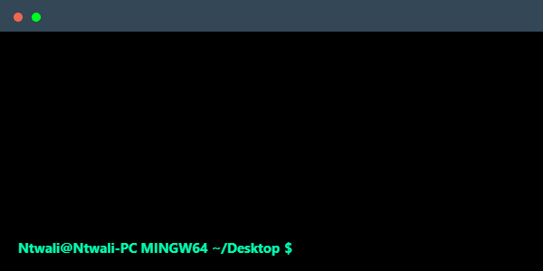

# Git-Exercises-Solution.

This readme file contain terminal codes solutions to my Git-Exercises 👌 <br> <br>


## Bundle 1

### Exercise 1

```bash
Ntwali@Ntwali-PC MINGW64 ~/Desktop
$ mkdir git-exercises

Ntwali@Ntwali-PC MINGW64 ~/Desktop
$ cd git-exercises

Ntwali@Ntwali-PC MINGW64 ~/Desktop/git-exercises
$ git init
Initialized empty Git repository in C:/Users/Ntwali/Desktop/git-exercises/.git/

Ntwali@Ntwali-PC MINGW64 ~/Desktop/git-exercises (main)
$ git branch -M master

Ntwali@Ntwali-PC MINGW64 ~/Desktop/git-exercises (master)
$ git branch -M main

Ntwali@Ntwali-PC MINGW64 ~/Desktop/git-exercises (main)
$ touch index.html

Ntwali@Ntwali-PC MINGW64 ~/Desktop/git-exercises (main)
$ code .

Ntwali@Ntwali-PC MINGW64 ~/Desktop/git-exercises (main)
$ mv index.html home.html

Ntwali@Ntwali-PC MINGW64 ~/Desktop/git-exercises (main)
$ git status
On branch main

No commits yet

Untracked files:
  (use "git add <file>..." to include in what will be committed)
        home.html

nothing added to commit but untracked files present (use "git add" to track)

Ntwali@Ntwali-PC MINGW64 ~/Desktop/git-exercises (main)
$ git add .

Ntwali@Ntwali-PC MINGW64 ~/Desktop/git-exercises (main)
$ git commit -m "initial commit"
[main (root-commit) 03c700c] initial commit
 1 file changed, 14 insertions(+)
 create mode 100644 home.html

Ntwali@Ntwali-PC MINGW64 ~/Desktop/git-exercises (main)
$ git remote add origin git@github.com:Iam-Ntwali/Git-Exercises.git

Ntwali@Ntwali-PC MINGW64 ~/Desktop/git-exercises (main)
$ git branch -M main

Ntwali@Ntwali-PC MINGW64 ~/Desktop/git-exercises (main)
$ git push -u origin main
Enumerating objects: 3, done.
Counting objects: 100% (3/3), done.
Delta compression using up to 4 threads
Compressing objects: 100% (2/2), done.
Writing objects: 100% (3/3), 411 bytes | 411.00 KiB/s, done.
Total 3 (delta 0), reused 0 (delta 0), pack-reused 0
To github.com:Iam-Ntwali/Git-Exercises.git
 * [new branch]      main -> main
branch 'main' set up to track 'origin/main'.
Ntwali@Ntwali-PC MINGW64 ~/Desktop/git-exercises (main)
$ git checkout -b dev
Switched to a new branch 'dev'

Ntwali@Ntwali-PC MINGW64 ~/Desktop/git-exercises (dev)
$ git checkout -b test
Switched to a new branch 'test'

Ntwali@Ntwali-PC MINGW64 ~/Desktop/git-exercises (test)
$ git switch dev
Switched to branch 'dev'

Ntwali@Ntwali-PC MINGW64 ~/Desktop/git-exercises (dev)
$ git branch -d test
Deleted branch test (was 03c700c).
```

### Exercise 2

```bash

```

## Bundle 2

### Exercise 1

```bash

```

### Exercise 2

```bash

```

## Bundle 3

### Exercise 1

```bash

```
